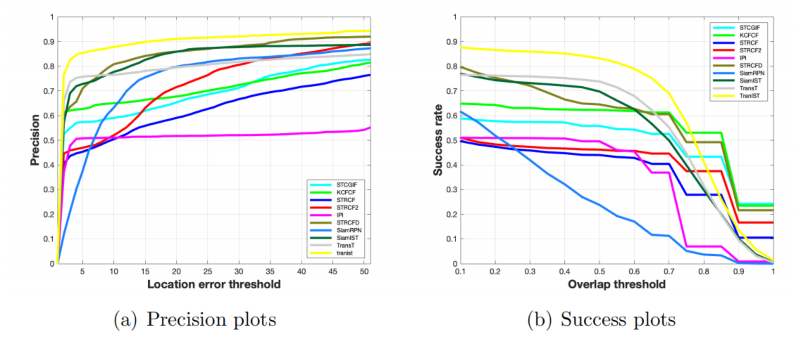

# TransIST
Aiming at the problem of unobvious target shape and weak signal of infrared weak small target, the system adopts Transformer Block with Multi-scale Attention (MSDA) to improve the model's ability to capture small features, and innovantly applies side window filtering (SWF) technology to pre-process infrared images to reduce noise interference and enhance target signal. Aiming at the problem of training fluctuation caused by the rapid movement of small targets, Exponential Moving Average (EMA) method was used to smooth the training curve to enhance the ability of robust tracking of small targets. Through a large number of experiments on the NIR data set, the final accuracy rate is 77.1% and the success rate is 48.9%


## Installation
This document contains detailed instructions for installing the necessary dependencied for **Transist**. The instructions 
have been tested on Ubuntu 18.04 system and 2080Ti GPU.

#### Install dependencies
* Create and activate a conda environment 
    ```bash
    conda create -n transist python=3.7
    conda activate transist
    ```  
* Install PyTorch
    ```bash
    conda install -c pytorch pytorch=1.5 torchvision=0.6.1 cudatoolkit=10.2
    ```  

* Install other packages
    ```bash
    conda install matplotlib pandas tqdm
    pip install opencv-python tb-nightly visdom scikit-image tikzplotlib gdown
    conda install cython scipy
    sudo apt-get install libturbojpeg
    pip install pycocotools jpeg4py
    pip install wget yacs
    pip install shapely==1.6.4.post2
    ```  
* Setup the environment                                                                                                 
Create the default environment setting files.

    ```bash
    # Change directory to <PATH_of_Transist>
    cd Transist
    
    # Environment settings for pytracking. Saved at pytracking/evaluation/local.py
    python -c "from pytracking.evaluation.environment import create_default_local_file; create_default_local_file()"
    
    # Environment settings for ltr. Saved at ltr/admin/local.py
    python -c "from ltr.admin.environment import create_default_local_file; create_default_local_file()"
    ```
You can modify these files to set the paths to datasets, results paths etc.
* Add the project path to environment variables  
Open ~/.bashrc, and add the following line to the end. Note to change <path_of_Transist> to your real path.
    ```
    export PYTHONPATH=<path_of_Transist>:$PYTHONPATH
    ```


## Quick Start
#### Traning
* Modify [local.py](ltr/admin/local.py) to set the paths to datasets, results paths etc.
* Runing the following commands to train the Transist. You can customize some parameters by modifying [transt.py](ltr/train_settings/transt/transt.py)
    ```bash
    conda activate transist
    cd ltr
    python run_training.py transist transist
    ```  

#### Evaluation

* We integrated [PySOT](https://github.com/STVIR/pysot) for evaluation. You can download json files in [PySOT](https://github.com/STVIR/pysot) or [here](https://drive.google.com/file/d/1PItNIOkui0iGCRglgsZPZF1-hkmj7vyv/view?usp=sharing).
    
    You need to specify the path of the model and dataset in the [test.py](pysot_toolkit/test.py).
    ```python
    net_path = '/path_to_model' #Absolute path of the model
    dataset_root= '/path_to_datasets' #Absolute path of the datasets
    ```  
    Then run the following commands.
    ```bash
    conda activate Transist
    cd Transist
    python -u pysot_toolkit/test.py --dataset <name of dataset> --name 'transist' #test tracker #test tracker
    python pysot_toolkit/eval.py --tracker_path results/ --dataset <name of dataset> --num 1 --tracker_prefix 'transist' #eval tracker
    ```  
    The testing results will in the current directory(results/dataset/transt/)
    
* You can also use [pytracking](pytracking) to test and evaluate tracker. 
The results might be slightly different with [PySOT](https://github.com/STVIR/pysot) due to the slight difference in implementation (pytracking saves results as integers, pysot toolkit saves the results as decimals).

#### Getting Help
If you meet problem, please try searching our Github issues, if you can't find solutions, feel free to open a new issue.
* `ImportError: cannot import name region`

Solution: You can just delete `from pysot_toolkit.toolkit.utils.region import vot_overlap, vot_float2str` in [test.py](pysot_toolkit/test.py) if you don't test VOT2019/18/16.
You can also build `region` by `python setup.py build_ext --inplace` in [pysot_toolkit](pysot_toolkit).

## Citation

```
@article{QIAN2025105674,
title = {TransIST: Transformer based infrared small target tracking using multi-scale feature and exponential moving average learning},
journal = {Infrared Physics & Technology},
volume = {145},
pages = {105674},
year = {2025},
author = {Kun Qian and Dingwei Zhu and Yutong Wu and Jian Shen and Shoujin Zhang}
}
```  

## Acknowledgement
Our  project is inspired by [TransT](https://github.com/chenxin-dlut/TransT) projects.
## Contact
* qiankun (email:kqian@jiangnan.edu.cn) or zhudingwei(email:1191210123@stu.jiangnan.edu.cn)

    Feel free to contact me if you have additional questions. 
